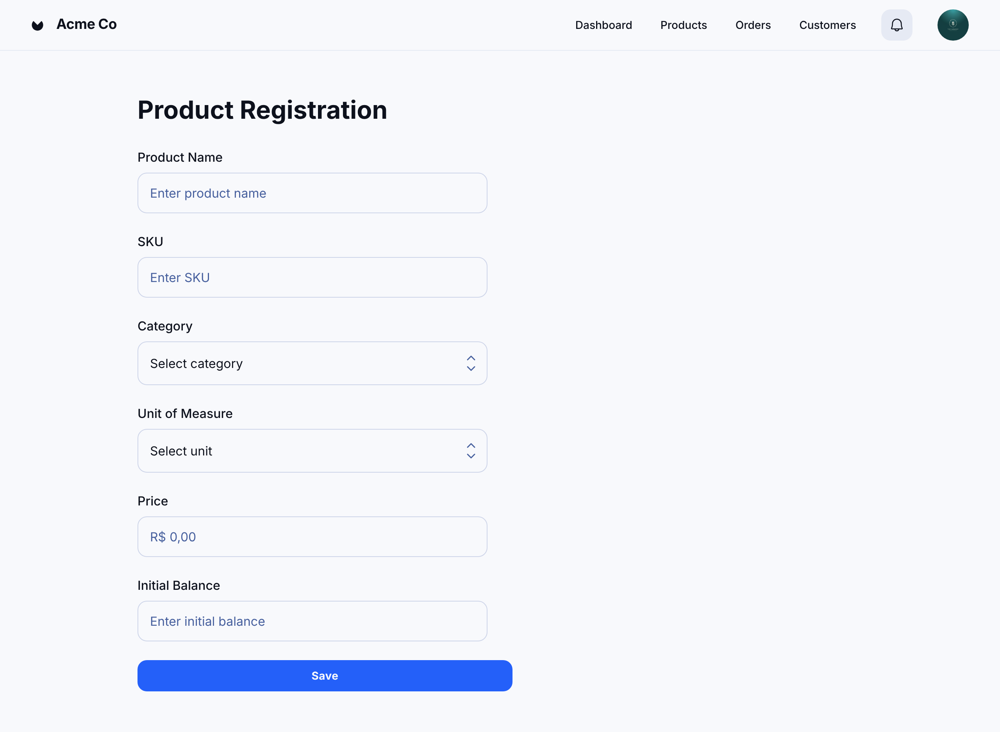

### HU01 — Cadastro de Produto com Validações de Campo

| **3 Ws** | **Conteúdo** |
|----------|--------------|
| **WHO? (Quem)** | **Administrador de Produtos** |
| **WHAT? (O Quê)** | **Cadastrar um novo produto** preenchendo todos os campos obrigatórios com validação em tempo real |
| **WHY? (Por Quê)** | **Garantir a integridade do catálogo** e evitar erros que prejudiquem preços, estoque ou integrações |

**História de Usuário Completa**  
> Como **Administrador de Produtos**, quero **cadastrar um novo produto com todas as validações de campo**, para que **o catálogo permaneça preciso e confiável**.

#### Descrição
O cadastro de produto é o ponto de entrada para todas as demais operações de estoque e vendas. Validações imediatas evitam dados incoerentes (SKU duplicado, preço negativo, valores vazios) e reduzem retrabalho.

#### ✅ Critérios de Aceite
1. **Campos Obrigatórios**: Nome, SKU (único), Categoria, Unidade, Preço, Saldo Inicial.  
2. **Validação em Tempo Real**: campos numéricos só aceitam números positivos; preço exibe máscara “R$ 0,00”.  
3. **Unicidade do SKU**: tentativa de salvar SKU já existente gera mensagem de erro clara.  
4. **Confirmação**: após salvar, sistema exibe notificação de sucesso e produto aparece na lista.  
5. **Persistência**: dados permanecem após recarregar a página ou relogar.

### Fluxo e interações

| Passo | Comportamento | Referência |
|-------|---------------|------------|
| 1 | **Botão “Salvar” começa desabilitado** enquanto existir ao menos um campo obrigatório vazio ou inválido. | Ver Critério ①[^1] |
| 2 | Validações em tempo real: números positivos, máscara “R$ 0,00” para preço. | Critério ②[^2] |
| 3 | Tentativa de salvar com **SKU duplicado** exibe erro inline e mantém foco no campo. | Critério ③[^3] |
| 4 | Quando tudo OK, botão habilita; ao clicar, mostra **toast “Produto cadastrado com sucesso”** e limpa o formulário. | Critério ④[^4] |
| 5 | Dados persistem após recarregar ou relogar, garantindo integridade do catálogo. | Critério ⑤[^5] |

[^1]: **Campos Obrigatórios** — HU01, Critério de Aceite 1  
[^2]: **Validação em Tempo Real** — HU01, Critério de Aceite 2  
[^3]: **Unicidade do SKU** — HU01, Critério de Aceite 3  
[^4]: **Confirmação** — HU01, Critério de Aceite 4  
[^5]: **Persistência** — HU01, Critério de Aceite 5

## 📋 Formulário de Avaliação – HU01

| Nº  | Requisito / Critério de aceite | Pergunta de avaliação | Não atendido | Atendido parcialmente | Atendido |
| --- | --- | --- | --- | --- | --- |
| 1 | Campos obrigatórios antes de salvar | O botão “Salvar” ficou desabilitado até todos os campos obrigatórios estarem válidos? |  | X |  |
| 2 | Validação em tempo real | Campos numéricos aceitaram apenas números positivos e o preço exibiu a máscara “R$ 0,00” corretamente? |  |  | X |
| 3 | SKU único | Ao tentar salvar um SKU duplicado, o sistema exibiu mensagem clara e manteve o foco no campo? |  | X |  |
| 4 | Confirmação | Após salvar com sucesso, foi exibido “Produto cadastrado com sucesso” e o formulário foi limpo? |  |  | X |
| 5 | Persistência | Os dados permaneceram após recarregar a página ou relogar? |  | X |  |

**Cálculo da nota HU01:  7**

---
