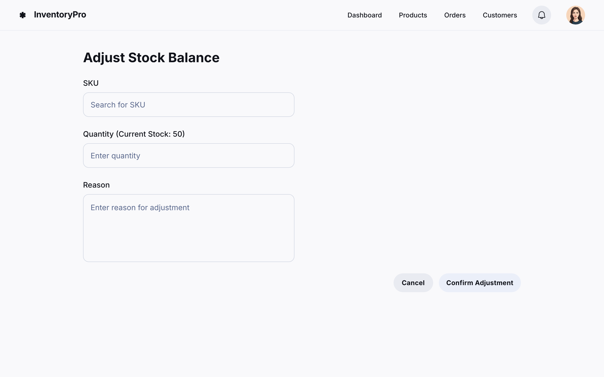

### HU02 — Ajuste Manual de Saldo de Estoque

| **3 Ws** | **Conteúdo** |
|----------|--------------|
| **WHO? (Quem)** | **Almoxarife** |
| **WHAT? (O Quê)** | **Registrar manualmente entradas ou saídas de estoque** por SKU, indicando quantidade e motivo |
| **WHY? (Por Quê)** | **Manter os saldos corretos** após recebimentos, devoluções ou perdas pontuais, evitando ruptura ou super-estoque |

**História de Usuário Completa**  
> Como **Almoxarife**, quero **ajustar o saldo de estoque de forma manual** (entrada ou saída), para **garantir que o sistema reflita a quantidade real disponível no depósito**.

#### Descrição
Ocorrências diárias — como devoluções de clientes, perdas por avaria ou recebimentos não previstos — exigem correções rápidas de quantidade. A interface deve permitir ao Almoxarife efetuar o ajuste em poucos cliques, com validação imediata e rastreabilidade.

#### ✅ Critérios de Aceite
1. **Formulário de Ajuste**: campos SKU (auto-completar), Quantidade (valor positivo ou negativo) e Motivo (texto livre obrigatório).  
2. **Validação em Tempo Real**:  
   - Quantidade não pode ser zero.  
   - Para saídas, quantidade não pode exceder o saldo atual.  
3. **Confirmação**: após salvar, sistema mostra notificação de sucesso e atualiza o saldo na tela de listagem de produtos.  
4. **Log de Movimentação**: cada ajuste gera registro contendo usuário, data/hora, quantidade e motivo.  
5. **Permissões**: somente usuários com papel Almoxarife ou Administrador podem realizar ajustes.  
6. **Persistência**: alterações permanecem após recarregar a página ou relogar.  

## HU02 — Ajuste Manual de Saldo de Estoque  

### Fluxo e interações

| Passo | Comportamento | Referência |
|-------|---------------|------------|
| 1 | **Botão “Confirmar ajuste”** inicia desabilitado até que SKU, Quantidade e Motivo estejam válidos. | Critério ①[^HU02-1] |
| 2 | Validação dinâmica: Quantidade ≠ 0 e, se negativa, não ultrapassa o saldo atual. | Critério ②[^HU02-2] |
| 3 | Confirmação gera **log de movimentação** (usuário, data/hora, qty, motivo). | Critério ④[^HU02-4] |
| 4 | Exibe **toast “Saldo ajustado com sucesso”** e atualiza a lista de produtos sem recarregar a página. | Critério ③[^HU02-3] |
| 5 | Apenas perfis **Almoxarife** ou **Administrador** podem abrir o modal; demais veem ação indisponível. | Critério ⑤[^HU02-5] |

[^HU02-1]: **Formulário de Ajuste** — HU02, Critério de Aceite 1 :contentReference[oaicite:11]{index=11}  
[^HU02-2]: **Validação em Tempo Real** — HU02, Critério de Aceite 2 :contentReference[oaicite:12]{index=12}  
[^HU02-3]: **Confirmação** — HU02, Critério de Aceite 3 :contentReference[oaicite:13]{index=13}  
[^HU02-4]: **Log de Movimentação** — HU02, Critério de Aceite 4 :contentReference[oaicite:14]{index=14}  
[^HU02-5]: **Permissões** — HU02, Critério de Aceite 5 :contentReference[oaicite:15]{index=15}  
