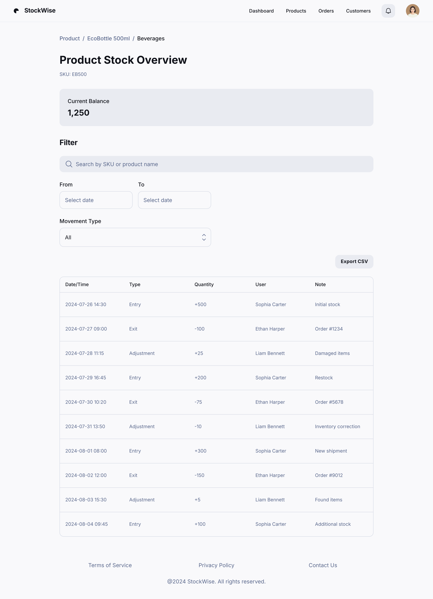

### HU03 — Visualização de Saldo e Histórico de Movimentos

| **3 Ws** | **Conteúdo** |
|----------|--------------|
| **WHO? (Quem)** | **Administrador** |
| **WHAT? (O Quê)** | **Consultar o saldo atual de um produto e seu histórico de movimentos** |
| **WHY? (Por Quê)** | **Auditar discrepâncias** e tomar decisões de compra ou venda baseadas em dados confiáveis |

**História de Usuário Completa**  
> Como **Administrador**, quero **ver o saldo atual e o histórico de movimentações de um produto**, para **investigar divergências e assegurar conformidade**.

#### Descrição
A funcionalidade oferece transparência sobre como o estoque chegou ao valor atual: entradas, saídas, ajustes e datas correspondentes.

#### ✅ Critérios de Aceite
1. **Saldo Atual**: valor numérico exibido no topo da página do produto.  
2. **Tabela de Movimentos**: lista paginada com Data/Hora, Tipo (Entrada/Saída/Ajuste), Quantidade, Usuário e Observação.  
3. **Filtros**: por intervalo de datas e tipo de movimento; resultados atualizam sem recarregar a página.  
4. **Exportar CSV**: histórico filtrado pode ser baixado em ≤ 5 s para até 10 000 registros.  
5. **Permissões**: somente perfis Administrador acessam o histórico completo.

### Fluxo e interações

| Passo | Comportamento | Referência |
|-------|---------------|------------|
| 1 | **Saldo atual** é exibido em destaque no topo da página do produto. | Critério ①[^HU03-1] |
| 2 | **Tabela paginada** mostra Data/Hora, Tipo, Quantidade, Usuário e Observação. | Critério ②[^HU03-2] |
| 3 | **Filtros** de data e tipo atualizam resultados via AJAX sem recarregar a página. | Critério ③[^HU03-3] |
| 4 | Botão **“Exportar CSV”** gera arquivo do resultado filtrado (≤ 10 000 registros) em até 5 s. | Critério ④[^HU03-4] |
| 5 | Página acessível somente ao **perfil Administrador**; demais recebem tela 403. | Critério ⑤[^HU03-5] |

[^HU03-1]: **Saldo Atual** — HU03, Critério de Aceite 1 :contentReference[oaicite:16]{index=16}  
[^HU03-2]: **Tabela de Movimentos** — HU03, Critério de Aceite 2 :contentReference[oaicite:17]{index=17}  
[^HU03-3]: **Filtros** — HU03, Critério de Aceite 3 :contentReference[oaicite:18]{index=18}  
[^HU03-4]: **Exportar CSV** — HU03, Critério de Aceite 4 :contentReference[oaicite:19]{index=19}  
[^HU03-5]: **Permissões** — HU03, Critério de Aceite 5 :contentReference[oaicite:20]{index=20}  
