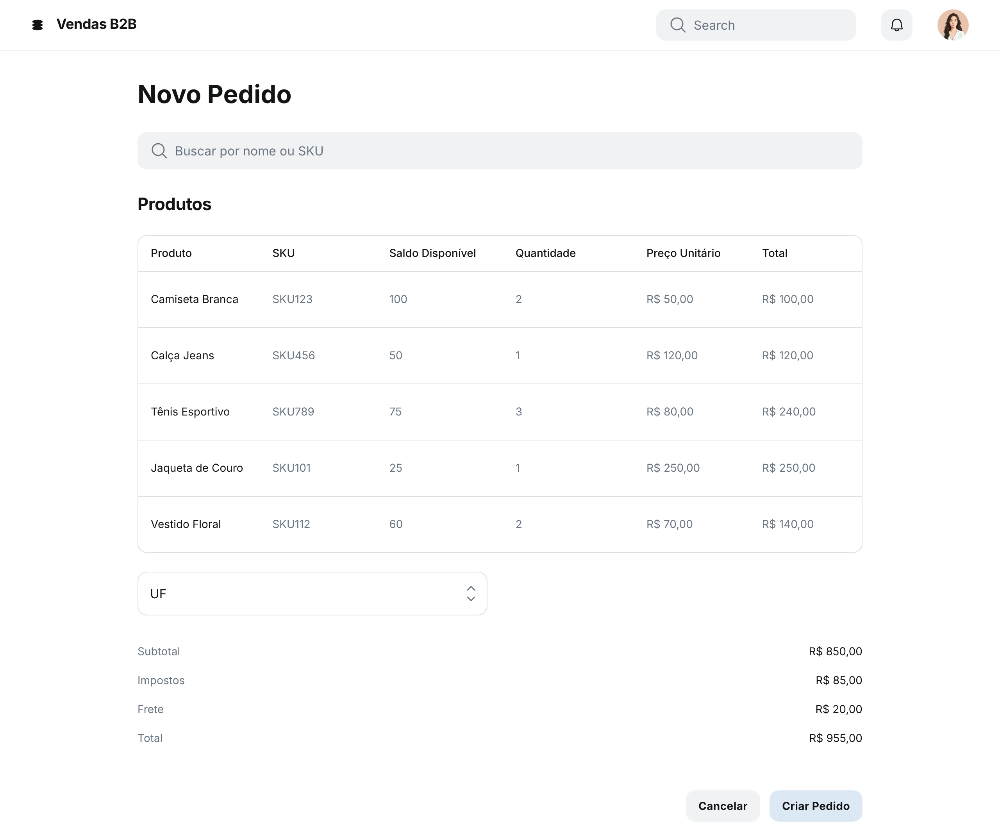

### HU01 — Criação de Pedido e Reserva de Estoque

| **3 Ws** | **Conteúdo** |
|----------|--------------|
| **WHO? (Quem)** | **Vendedor B2B** |
| **WHAT? (O Quê)** | **Criar um novo pedido** selecionando itens, quantidades e condições de entrega, com validação de estoque em tempo real |
| **WHY? (Por Quê)** | **Fechar a venda rapidamente e garantir a disponibilidade dos produtos** para o cliente |

**História de Usuário Completa**  
> Como **Vendedor B2B**, quero **criar um pedido e reservar automaticamente o estoque dos itens solicitados**, para que **o cliente tenha garantia de que receberá os produtos comprados**.

#### Descrição
O formulário de pedido deve ser simples, permitindo busca de produtos, exibição de saldo disponível e cálculo automático de impostos e frete conforme UF e valor do pedido.

#### ✅ Critérios de Aceite
1. **Busca de Produtos**: autocomplete por nome ou SKU com exibição de saldo disponível.  
2. **Validação de Estoque**: sistema impede adicionar quantidade maior do que o saldo; mostra alerta em tempo real.  
3. **Cálculo Automático**: impostos (ICMS/ISS) e frete calculados após inserir CEP do cliente.  
4. **Resumo do Pedido**: total de itens, impostos, frete e valor final antes de salvar.  
5. **Reserva**: ao salvar, quantidade solicitada é reservada por até 24 h (ou até aprovação) e exibida no log de movimento.  
6. **Confirmação**: notificação de sucesso + e-mail ao cliente com número do pedido.

## Fluxo e interações

| Passo | Comportamento | Referência |
|---|---|---|
| 1 | O vendedor inicia a criação de um novo pedido e busca produtos por nome ou SKU. O sistema exibe o saldo disponível para cada produto. | Critério ① |
| 2 | Ao adicionar produtos ao pedido, o sistema valida a quantidade em estoque em tempo real, impedindo a adição de quantidades maiores que o saldo disponível e exibindo um alerta. | Critério ② |
| 3 | Após inserir o CEP do cliente, o sistema calcula automaticamente os impostos (ICMS/ISS) e o frete. | Critério ③ |
| 4 | Antes de finalizar o pedido, o sistema exibe um resumo detalhado, incluindo o total de itens, impostos, frete e o valor final do pedido. | Critério ④ |
| 5 | Ao salvar o pedido, a quantidade solicitada dos produtos é automaticamente reservada por até 24 horas (ou até a aprovação do pedido) e registrada no log de movimento. | Critério ⑤ |
| 6 | Após a confirmação do pedido, o sistema exibe uma notificação de sucesso e envia um e-mail ao cliente com o número do pedido. | Critério ⑥ |

1. Busca de Produtos — HU01, Critério de Aceite 1 ↩
2. Validação de Estoque — HU01, Critério de Aceite 2 ↩
3. Cálculo Automático — HU01, Critério de Aceite 3 ↩
4. Resumo do Pedido — HU01, Critério de Aceite 4 ↩
5. Reserva — HU01, Critério de Aceite 5 ↩
6. Confirmação — HU01, Critério de Aceite 6 ↩
