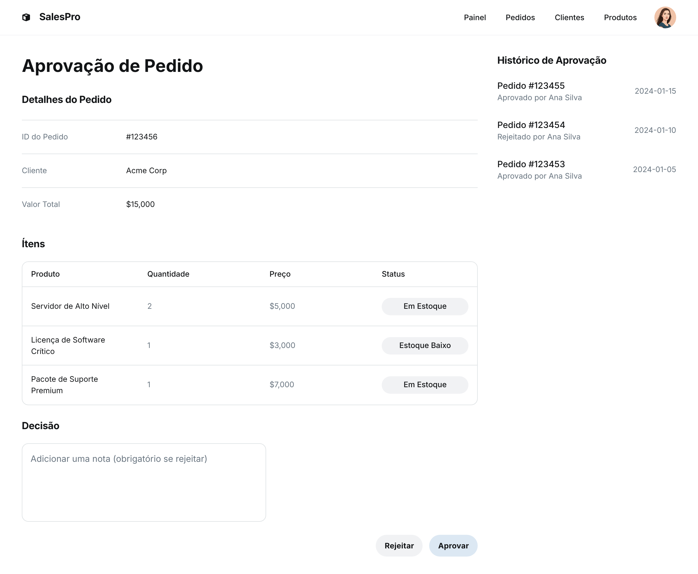

### HU02 — Aprovação de Pedidos de Alto Valor

| **3 Ws** | **Conteúdo** |
|----------|--------------|
| **WHO? (Quem)** | **Gerente Comercial** |
| **WHAT? (O Quê)** | **Aprovar ou rejeitar pedidos** que ultrapassam um limite de valor ou envolvem produtos críticos |
| **WHY? (Por Quê)** | **Garantir conformidade com políticas de risco e margem**, evitando vendas não autorizadas |

**História de Usuário Completa**  
> Como **Gerente Comercial**, quero **aprovar ou rejeitar pedidos que excedem R$ X ou envolvem estoque crítico**, para **assegurar que apenas vendas viáveis sejam processadas**.

#### Descrição
Pedidos que atingem certos limiares entram automaticamente em estágio *Em Aprovação*. Gestores recebem notificação e podem aprovar ou rejeitar diretamente pelo sistema.

#### ✅ Critérios de Aceite
1. **Gatilho**: pedidos > R$ X **ou** que deixem saldo de item crítico < ponto de reposição entram em “Em Aprovação”.  
2. **Notificação**: gerente recebe e-mail com link direto para o pedido.  
3. **Ação**: gerente clica em **Aprovar** ou **Rejeitar**; deve preencher observação obrigatória ao rejeitar.  
4. **Transação**: ao aprovar, reserva se torna definitiva; ao rejeitar, reserva é liberada imediatamente.  
5. **Registro**: decisão, usuário e data/hora gravados no histórico do pedido.  
6. **Feedback ao Vendedor**: status atualizado em tempo real no Kanban e e-mail automático.

## Fluxo e interações

| Passo | Comportamento | Referência |
|---|---|---|
| 1 | Pedidos que excedem R$ X ou que deixam o saldo de um item crítico abaixo do ponto de reposição entram automaticamente no estágio "Em Aprovação". | Critério ① |
| 2 | O Gerente Comercial recebe uma notificação por e-mail com um link direto para o pedido que precisa de aprovação. | Critério ② |
| 3 | O Gerente Comercial pode clicar em "Aprovar" ou "Rejeitar" o pedido. Se rejeitar, deve preencher uma observação obrigatória. | Critério ③ |
| 4 | Ao aprovar o pedido, a reserva de estoque torna-se definitiva. Ao rejeitar, a reserva é liberada imediatamente. | Critério ④ |
| 5 | A decisão (aprovação/rejeição), o usuário que realizou a ação e a data/hora são gravados no histórico do pedido. | Critério ⑤ |
| 6 | O status do pedido é atualizado em tempo real no Kanban e um e-mail automático é enviado ao vendedor com o feedback da decisão. | Critério ⑥ |

1. Gatilho — HU02, Critério de Aceite 1 ↩
2. Notificação — HU02, Critério de Aceite 2 ↩
3. Ação — HU02, Critério de Aceite 3 ↩
4. Transação — HU02, Critério de Aceite 4 ↩
5. Registro — HU02, Critério de Aceite 5 ↩
6. Feedback ao Vendedor — HU02, Critério de Aceite 6 ↩
---
