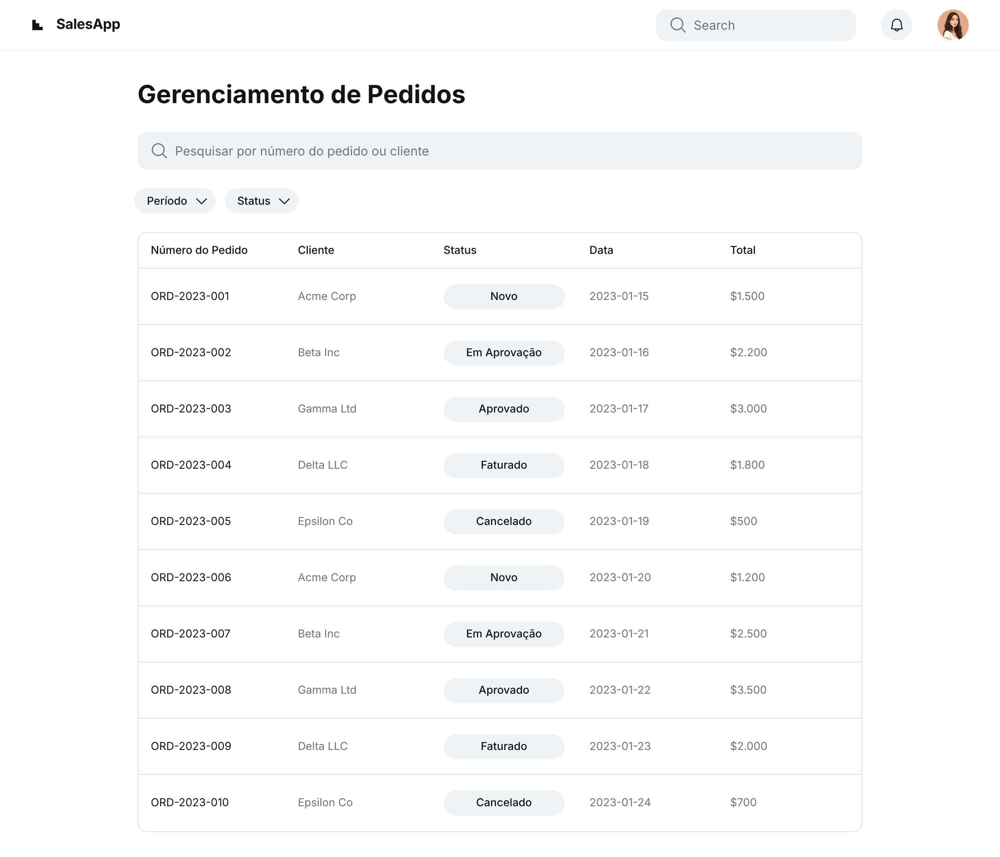

### HU03 — Consulta e Atualização de Status do Pedido

| **3 Ws** | **Conteúdo** |
|----------|--------------|
| **WHO? (Quem)** | **Vendedor B2B** (equipe interna) |
| **WHAT? (O Quê)** | **Acompanhar o status do pedido em um painel Kanban** e atualizar etapas intermediárias (ex.: faturado) |
| **WHY? (Por Quê)** | **Manter cliente e equipe informados** e reduzir dúvidas sobre andamento da entrega |

**História de Usuário Completa**  
> Como **Vendedor B2B**, quero **visualizar e atualizar o status do meu pedido em um painel Kanban**, para **acompanhar todo o ciclo até a entrega e informar o cliente prontamente**.

#### Descrição
Cada pedido percorre status pré-definidos: Novo → Em Aprovação → Aprovado → Faturado → Cancelado. O painel Kanban oferece visão rápida e permite transições autorizadas.

#### ✅ Critérios de Aceite
1. **Kanban**: colunas contendo cartões dos pedidos ordenados por data de criação.  
2. **Permissões**: vendedor pode mover cartões apenas entre estados permitidos (ex.: Aprovado → Faturado).  
3. **Atualização**: Atualizar os dados grava mudança, usuário e timestamp no histórico.  
4. **Detalhe do Pedido**: clique no cartão abre modal com itens, valores e timeline de status.  
5. **Notificações**: mudança para “Faturado” gera PDF da NF ou confirmação e envia e-mail ao cliente.  
6. **Pesquisa/Filtro**: campo para buscar pedidos por número ou cliente; filtros por período e status aplicados em tempo real.

## Fluxo e interações

| Passo | Comportamento | Referência |
|---|---|---|
| 1 | O vendedor acessa o painel Kanban, onde os pedidos são exibidos como cartões em colunas de status (Novo, Em Aprovação, Aprovado, Faturado, Cancelado), ordenados por data de criação. | Critério ① |
| 2 | O vendedor pode mover os cartões dos pedidos entre os estados, respeitando as permissões de transição (ex: de "Aprovado" para "Faturado"). | Critério ② |
| 3 | Ao atualizar o status de um pedido, o sistema grava a mudança, o usuário responsável e o timestamp no histórico do pedido. | Critério ③ |
| 4 | Ao clicar em um cartão de pedido, um modal é aberto exibindo detalhes como itens, valores e uma linha do tempo com o histórico de status. | Critério ④ |
| 5 | Quando o status do pedido muda para "Faturado", o sistema gera um PDF da Nota Fiscal ou uma confirmação e envia um e-mail automático ao cliente. | Critério ⑤ |
| 6 | O vendedor pode utilizar os campos de pesquisa e filtro para buscar pedidos por número ou cliente, e aplicar filtros por período e status em tempo real. | Critério ⑥ |

1. Kanban — HU03, Critério de Aceite 1 ↩
2. Permissões — HU03, Critério de Aceite 2 ↩
3. Atualização — HU03, Critério de Aceite 3 ↩
4. Detalhe do Pedido — HU03, Critério de Aceite 4 ↩
5. Notificações — HU03, Critério de Aceite 5 ↩
6. Pesquisa/Filtro — HU03, Critério de Aceite 6 ↩
