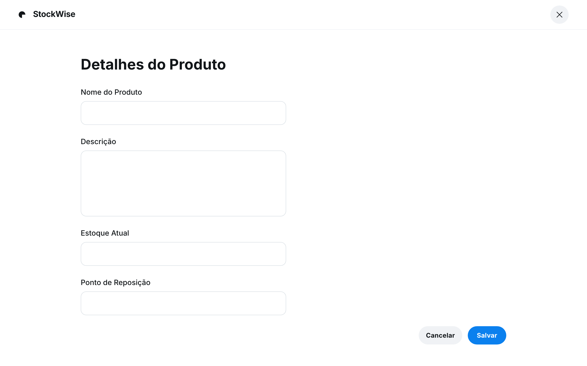

### HU01 — Definir Ponto de Reposição por SKU

| **3 Ws** | **Conteúdo** |
|----------|--------------|
| **WHO? (Quem)** | **Almoxarife** |
| **WHAT? (O Quê)** | **Definir um ponto de reposição (em unidades) para cada SKU** |
| **WHY? (Por Quê)** | **Para que o sistema possa me alertar ou gerar uma ordem de compra automaticamente quando o estoque atingir esse nível.** |

**História de Usuário Completa**
> Como **almoxarife**, quero **definir um ponto de reposição (em unidades) para cada SKU**, para que **o sistema possa me alertar ou gerar uma ordem de compra automaticamente quando o estoque atingir esse nível**.

#### Descrição
O ponto de reposição é crucial para a gestão eficiente do estoque, garantindo que os produtos estejam sempre disponíveis e evitando rupturas. A definição clara desse ponto permite a automação de processos de reabastecimento e alertas proativos.

#### ✅ Critérios de Aceite
1.  Na tela de detalhes do produto, deve haver um campo numérico para "Ponto de Reposição".
2.  O valor deve ser maior que zero.
3.  Ao salvar, o sistema armazena a informação e a exibe na lista de produtos.

## Fluxo e interações

| Passo | Comportamento | Referência |
|---|---|---|
| 1 | O almoxarife acessa a tela de detalhes do produto. | Imagem HU1.png |
| 2 | O almoxarife localiza o campo numérico "Ponto de Reposição". | Critério ①, Imagem HU1.png |
| 3 | O almoxarife insere um valor numérico maior que zero no campo "Ponto de Reposição". | Critério ② |
| 4 | O almoxarife clica no botão "Salvar" para registrar o ponto de reposição. | Imagem HU1.png |
| 5 | O sistema armazena a informação do ponto de reposição e a exibe na lista de produtos. | Critério ③ |

1. Na tela de detalhes do produto, deve haver um campo numérico para "Ponto de Reposição".
2. O valor deve ser maior que zero.
3. Ao salvar, o sistema armazena a informação e a exibe na lista de produtos.
