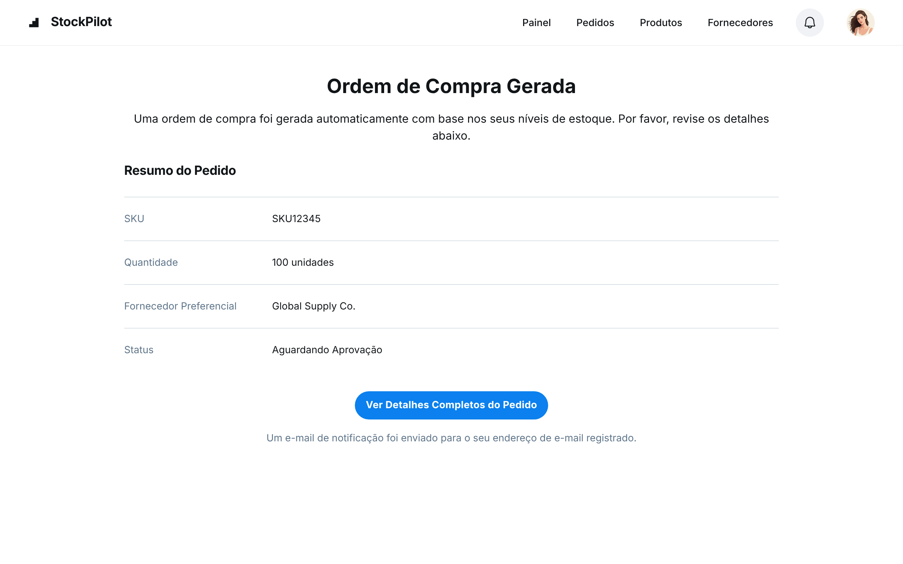

### HU02 — Geração Automática de Ordem de Compra ao atingir limite

| **3 Ws** | **Conteúdo** |
|----------|--------------|
| **WHO? (Quem)** | **Comprador** |
| **WHAT? (O Quê)** | **Que o sistema gere uma ordem de compra automaticamente para o fornecedor preferencial** |
| **WHY? (Por Quê)** | **Para não precisar monitorar o estoque manualmente e o processo de compra seja agilizado.** |

**História de Usuário Completa**
> Como **comprador**, quero **que o sistema gere uma ordem de compra automaticamente para o fornecedor preferencial**, para que **eu não precise monitorar o estoque manualmente e o processo de compra seja agilizado**.

#### Descrição
A geração automática de ordens de compra otimiza o processo de reabastecimento, reduzindo a carga de trabalho manual e minimizando o risco de falta de estoque. Isso garante que os produtos estejam sempre disponíveis para atender à demanda.

#### ✅ Critérios de Aceite
1.  Quando o saldo de um SKU se torna igual ou inferior ao ponto de reposição, uma OC deve ser criada.
2.  A OC deve conter o SKU, a quantidade padrão de compra e os dados do fornecedor preferencial.
3.  A OC deve ser criada com o status "Pendente de Aprovação".
4.  Um e-mail de notificação deve ser enviado para o comprador responsável.

## Fluxo e interações

| Passo | Comportamento | Referência |
|---|---|---|
| 1 | O saldo de um SKU atinge ou fica abaixo do ponto de reposição definido. | Critério ① |
| 2 | O sistema automaticamente gera uma Ordem de Compra (OC) e exibe a tela "Ordem de Compra Gerada". | Critério ①, Imagem HU2.png |
| 3 | A OC gerada contém o SKU (ex: SKU12345), a quantidade padrão de compra (ex: 100 unidades) e os dados do fornecedor preferencial (ex: Global Supply Co.). | Critério ②, Imagem HU2.png |
| 4 | A OC é criada com o status "Aguardando Aprovação" conforme exibido na tela. | Critério ③, Imagem HU2.png |
| 5 | Um e-mail de notificação é enviado para o endereço de e-mail registrado do comprador responsável, conforme indicado na tela. | Critério ④, Imagem HU2.png |
| 6 | O comprador pode clicar em "Ver Detalhes Completos do Pedido" para acessar informações mais detalhadas sobre a OC gerada. | Imagem HU2.png |

1. Quando o saldo de um SKU se torna igual ou inferior ao ponto de reposição, uma OC deve ser criada. ↩
2. A OC deve conter o SKU, a quantidade padrão de compra e os dados do fornecedor preferencial. ↩
3. A OC deve ser criada com o status "Pendente de Aprovação". ↩
4. Um e-mail de notificação deve ser enviado para o comprador responsável. ↩

