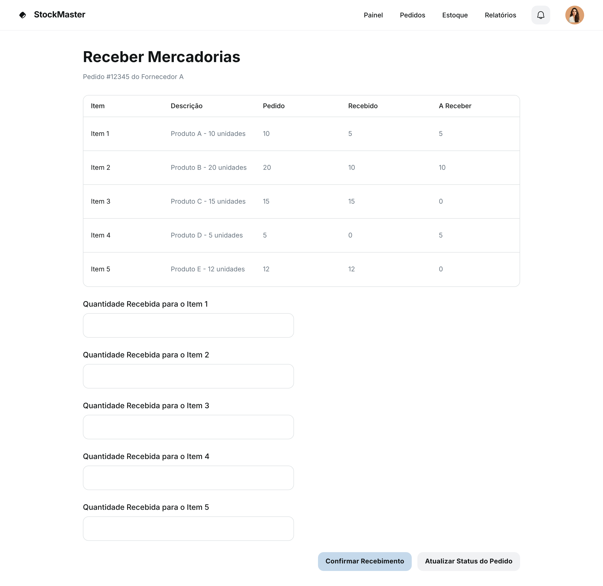

### HU03 — Recebimento de Mercadoria e ajuste de estoque

| **3 Ws** | **Conteúdo** |
|----------|--------------|
| **WHO? (Quem)** | **Almoxarife** |
| **WHAT? (O Quê)** | **Registrar o recebimento de uma mercadoria (total ou parcial) referente a uma ordem de compra** |
| **WHY? (Por Quê)** | **Para que o saldo do estoque seja atualizado e a equipe de vendas tenha visibilidade da disponibilidade do produto.** |

**História de Usuário Completa**
> Como **almoxarife**, quero **registrar o recebimento de uma mercadoria (total ou parcial) referente a uma ordem de compra**, para que **o saldo do estoque seja atualizado e a equipe de vendas tenha visibilidade da disponibilidade do produto**.

#### Descrição
O registro preciso do recebimento de mercadorias é fundamental para manter o controle de estoque atualizado e garantir a disponibilidade dos produtos para vendas. Isso impacta diretamente a eficiência da cadeia de suprimentos e a satisfação do cliente.

#### ✅ Critérios de Aceite
1.  Na tela da Ordem de Compra, deve haver um botão "Receber Mercadoria".
2.  Ao clicar, o sistema deve exibir os itens da OC e permitir a inserção da quantidade recebida para cada um.
3.  Após a confirmação, o saldo do estoque dos produtos recebidos deve ser atualizado.
4.  O status da OC deve ser atualizado para "Recebida Parcialmente" ou "Recebida Totalmente".

## Fluxo e interações

| Passo | Comportamento | Referência |
|---|---|---|
| 1 | O almoxarife acessa a tela de "Receber Mercadorias" para uma Ordem de Compra específica. | Imagem HU3.png |
| 2 | O sistema exibe os itens da OC com as quantidades pedidas, recebidas e a receber. | Imagem HU3.png |
| 3 | O almoxarife insere a quantidade recebida para cada item nos campos correspondentes. | Critério ②, Imagem HU3.png |
| 4 | Após inserir as quantidades, o almoxarife clica no botão "Confirmar Recebimento". | Imagem HU3.png |
| 5 | O sistema atualiza o saldo do estoque dos produtos recebidos. | Critério ③ |
| 6 | O status da OC é atualizado para "Recebida Parcialmente" ou "Recebida Totalmente", dependendo das quantidades recebidas. | Critério ④ |
| 7 | O almoxarife pode clicar em "Atualizar Status do Pedido" para forçar a atualização do status da OC. | Imagem HU3.png |

1. Na tela da Ordem de Compra, deve haver um botão "Receber Mercadoria".
2. Ao clicar, o sistema deve exibir os itens da OC e permitir a inserção da quantidade recebida para cada um.
3. Após a confirmação, o saldo do estoque dos produtos recebidos deve ser atualizado.
4. O status da OC deve ser atualizado para "Recebida Parcialmente" ou "Recebida Totalmente".
