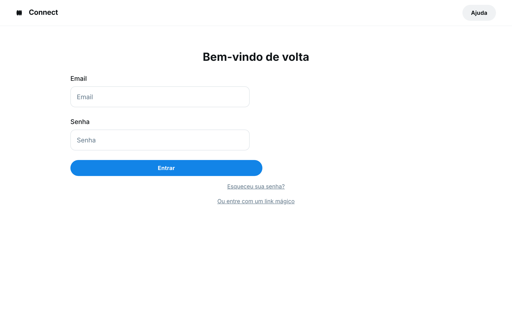

### HU01 — Login do Cliente e acesso ao Catálogo

| **3 Ws** | **Conteúdo** |
|----------|--------------|
| **WHO? (Quem)** | **Cliente B2B** |
| **WHAT? (O Quê)** | **Fazer login no sistema usando credenciais ou link mágico** |
| **WHY? (Por Quê)** | **Para acessar o catálogo de produtos e realizar pedidos.** |

**História de Usuário Completa**
> Como **cliente B2B**, quero **fazer login no sistema usando minhas credenciais (e-mail e senha) ou um link mágico**, para que **eu possa acessar o catálogo de produtos e realizar pedidos**.

#### Descrição
O acesso seguro e facilitado ao catálogo de produtos é o primeiro passo para que o cliente B2B possa explorar as ofertas e iniciar o processo de compra. A flexibilidade de login (credenciais ou link mágico) visa otimizar a experiência do usuário.

#### ✅ Critérios de Aceite
1.  O cliente deve ser redirecionado para a página inicial do catálogo após um login bem-sucedido.
2.  Em caso de credenciais inválidas, uma mensagem de erro clara deve ser exibida.
3.  O link mágico deve autenticar o usuário e redirecioná-lo para o catálogo.

## Fluxo e interações

| Passo | Comportamento | Referência |
|---|---|---|
| 1 | O cliente acessa a tela de login, que apresenta campos para E-mail e Senha, além das opções "Esqueceu sua senha?" e "Ou entre com um link mágico". | Imagem HU1.png |
| 2 | **Login com Credenciais:** O cliente insere seu e-mail e senha nos campos correspondentes. | Imagem HU1.png |
| 3 | O cliente clica no botão "Entrar". | Imagem HU1.png |
| 4 | O sistema valida as credenciais. Se forem válidas, o cliente é redirecionado para a página inicial do catálogo. | Critério ① |
| 5 | Se as credenciais forem inválidas, uma mensagem de erro clara é exibida na tela. | Critério ② |
| 6 | **Login com Link Mágico:** O cliente clica na opção "Ou entre com um link mágico". | Imagem HU1.png |
| 7 | O sistema autentica o usuário através do link mágico e o redireciona para a página inicial do catálogo. | Critério ③ |

1. O cliente deve ser redirecionado para a página inicial do catálogo após um login bem-sucedido. ↩
2. Em caso de credenciais inválidas, uma mensagem de erro clara deve ser exibida. ↩
3. O link mágico deve autenticar o usuário e redirecioná-lo para o catálogo. ↩

