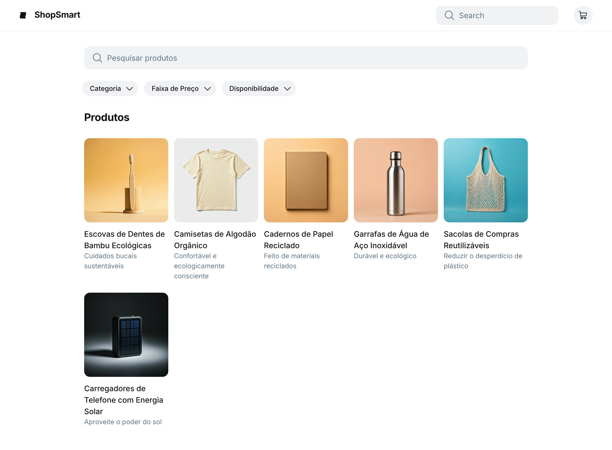

### HU02 — Pesquisa e Filtragem de Produtos

| **3 Ws** | **Conteúdo** |
|----------|--------------|
| **WHO? (Quem)** | **Cliente B2B** |
| **WHAT? (O Quê)** | **Pesquisar produtos por nome ou categoria e aplicar filtros por faixa de preço e disponibilidade** |
| **WHY? (Por Quê)** | **Para encontrar rapidamente os produtos que me interessam.** |

**História de Usuário Completa**
> Como **cliente B2B**, quero **pesquisar produtos por nome ou categoria e aplicar filtros por faixa de preço e disponibilidade**, para que **eu possa encontrar rapidamente os produtos que me interessam**.

#### Descrição
A funcionalidade de pesquisa e filtragem é essencial para a usabilidade do catálogo, permitindo que o cliente localize produtos específicos de forma eficiente, economizando tempo e melhorando a experiência de compra.

#### ✅ Critérios de Aceite
1.  A pesquisa por nome deve retornar produtos que contenham o termo pesquisado.
2.  A filtragem por categoria deve exibir apenas produtos da categoria selecionada.
3.  A filtragem por faixa de preço deve mostrar produtos dentro do intervalo especificado.
4.  A filtragem por disponibilidade deve exibir apenas produtos com estoque disponível.

## Fluxo e interações

| Passo | Comportamento | Referência |
|---|---|---|
| 1 | O cliente acessa a página do catálogo de produtos, que exibe uma barra de pesquisa e opções de filtro para Categoria, Faixa de Preço e Disponibilidade. | Imagem HU2.png |
| 2 | O cliente digita um termo na barra de pesquisa para buscar produtos por nome. | Critério ①, Imagem HU2.png |
| 3 | O sistema retorna produtos que contêm o termo pesquisado. | Critério ① |
| 4 | O cliente seleciona uma categoria no filtro "Categoria". | Critério ②, Imagem HU2.png |
| 5 | O sistema exibe apenas os produtos pertencentes à categoria selecionada. | Critério ② |
| 6 | O cliente especifica uma faixa de preço no filtro "Faixa de Preço". | Critério ③, Imagem HU2.png |
| 7 | O sistema mostra apenas os produtos que se encaixam no intervalo de preço especificado. | Critério ③ |
| 8 | O cliente aplica o filtro de "Disponibilidade". | Critério ④, Imagem HU2.png |
| 9 | O sistema exibe somente os produtos que possuem estoque disponível. | Critério ④ |

1. A pesquisa por nome deve retornar produtos que contenham o termo pesquisado. ↩
2. A filtragem por categoria deve exibir apenas produtos da categoria selecionada. ↩
3. A filtragem por faixa de preço deve mostrar produtos dentro do intervalo especificado. ↩
4. A filtragem por disponibilidade deve exibir apenas produtos com estoque disponível. ↩

