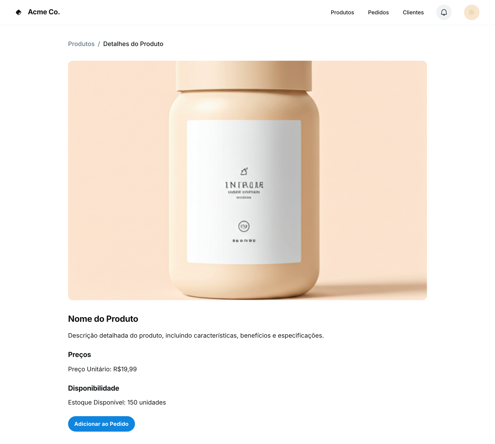

### HU03 — Visualização de Detalhes de Produto

| **3 Ws** | **Conteúdo** |
|----------|--------------|
| **WHO? (Quem)** | **Cliente B2B** |
| **WHAT? (O Quê)** | **Visualizar os detalhes de um produto, incluindo foto, descrição, preço e saldo disponível** |
| **WHY? (Por Quê)** | **Para tomar uma decisão informada antes de adicionar o produto ao meu pedido.** |

**História de Usuário Completa**
> Como **cliente B2B**, quero **visualizar os detalhes de um produto, incluindo foto, descrição, preço e saldo disponível**, para que **eu possa tomar uma decisão informada antes de adicionar o produto ao meu pedido**.

#### Descrição
A visualização detalhada do produto é crucial para que o cliente B2B possa avaliar todas as características, preço e disponibilidade antes de efetuar a compra. Isso minimiza dúvidas e aumenta a confiança na decisão de compra.

#### ✅ Critérios de Aceite
1.  Ao clicar em um produto na lista, uma página de detalhes do produto deve ser exibida.
2.  A página de detalhes deve conter a imagem do produto, uma descrição completa, o preço unitário e a quantidade em estoque.
3.  As informações exibidas devem ser precisas e atualizadas.

## Fluxo e interações

| Passo | Comportamento | Referência |
|---|---|---|
| 1 | O cliente navega pelo catálogo de produtos e clica em um produto de interesse. | Critério ① |
| 2 | O sistema exibe a página de "Detalhes do Produto" com a imagem do produto em destaque. | Critério ①, Imagem HU3.png |
| 3 | A página de detalhes apresenta o "Nome do Produto" e uma "Descrição detalhada do produto, incluindo características, benefícios e especificações". | Critério ②, Imagem HU3.png |
| 4 | O preço unitário do produto é exibido na seção "Preços" (ex: R$19,99). | Critério ②, Imagem HU3.png |
| 5 | A quantidade disponível em estoque é mostrada na seção "Disponibilidade" (ex: 150 unidades). | Critério ②, Imagem HU3.png |
| 6 | Todas as informações exibidas são precisas e atualizadas, permitindo ao cliente tomar uma decisão informada. | Critério ③ |
| 7 | O cliente tem a opção de clicar no botão "Adicionar ao Pedido". | Imagem HU3.png |

1. Ao clicar em um produto na lista, uma página de detalhes do produto deve ser exibida. ↩
2. A página de detalhes deve conter a imagem do produto, uma descrição completa, o preço unitário e a quantidade em estoque. ↩
3. As informações exibidas devem ser precisas e atualizadas. ↩

