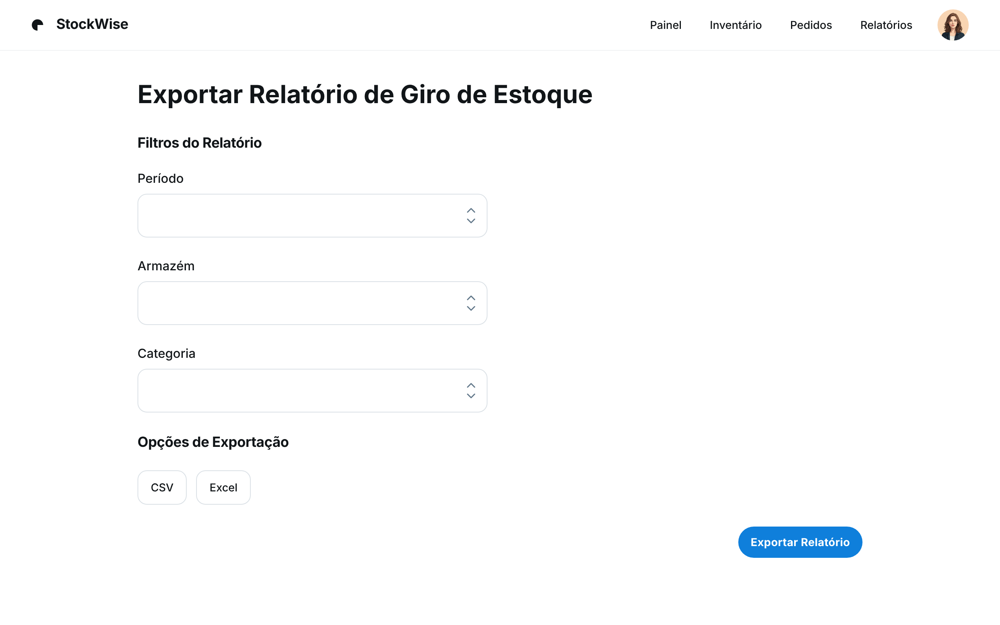

### HU02 — Exportar Relatório de Giro de Estoque

| **3 Ws** | **Conteúdo** |
|----------|--------------|
| **WHO? (Quem)** | **Gerente Operacional** |
| **WHAT? (O Quê)** | **Exportar um relatório de giro de estoque em formato CSV/Excel** |
| **WHY? (Por Quê)** | **Para analisar detalhadamente a movimentação dos produtos e tomar decisões sobre compras e promoções.** |

**História de Usuário Completa**
> Como **Gerente Operacional**, quero **exportar um relatório de giro de estoque em formato CSV/Excel**, para que **eu possa analisar detalhadamente a movimentação dos produtos e tomar decisões sobre compras e promoções**.

#### Descrição
O relatório de giro de estoque fornece dados cruciais para a gestão de inventário, permitindo identificar produtos com alta ou baixa rotatividade. A exportação em formatos comuns facilita a análise em ferramentas externas e a colaboração com outras equipes.

#### ✅ Critérios de Aceite
1.  Deve haver uma opção para exportar o relatório de giro de estoque.
2.  O relatório deve ser gerado em formato CSV ou Excel.
3.  O arquivo exportado deve conter colunas relevantes como SKU, nome do produto, quantidade vendida, quantidade comprada, saldo atual e taxa de giro.
4.  A exportação deve ser concluída em até 10 segundos para 10.000 registros.

## Fluxo e interações

| Passo | Comportamento | Referência |
|---|---|---|
| 1 | O Gerente Operacional acessa a tela "Exportar Relatório de Giro de Estoque". | Imagem HU2.png |
| 2 | O gerente pode aplicar filtros ao relatório por "Período", "Armazém" e "Categoria". | Imagem HU2.png |
| 3 | O gerente seleciona o formato de exportação desejado: "CSV" ou "Excel". | Critério ②, Imagem HU2.png |
| 4 | O gerente clica no botão "Exportar Relatório". | Imagem HU2.png |
| 5 | O sistema gera o relatório com colunas relevantes como SKU, nome do produto, quantidade vendida, quantidade comprada, saldo atual e taxa de giro. | Critério ③ |
| 6 | O relatório é exportado no formato selecionado (CSV ou Excel) em até 10 segundos para 10.000 registros. | Critério ②, Critério ④ |

1. Deve haver uma opção para exportar o relatório de giro de estoque. ↩
2. O relatório deve ser gerado em formato CSV ou Excel. ↩
3. O arquivo exportado deve conter colunas relevantes como SKU, nome do produto, quantidade vendida, quantidade comprada, saldo atual e taxa de giro. ↩
4. A exportação deve ser concluída em até 10 segundos para 10.000 registros. ↩

