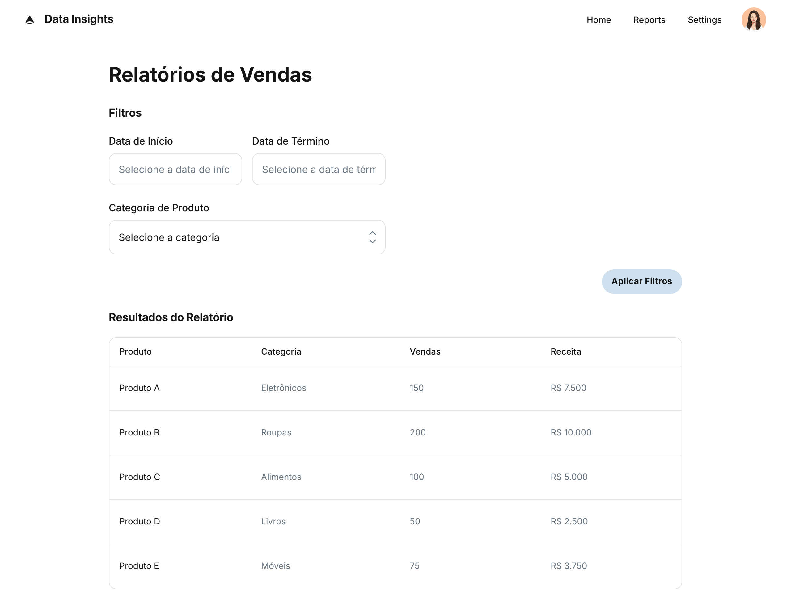

### HU03 — Aplicar Filtros de Data e Categoria em Relatórios

| **3 Ws** | **Conteúdo** |
|----------|--------------|
| **WHO? (Quem)** | **Gerente Operacional** |
| **WHAT? (O Quê)** | **Aplicar filtros por intervalo de datas e categoria de produto nos relatórios** |
| **WHY? (Por Quê)** | **Para refinar a análise e focar em períodos ou segmentos específicos.** |

**História de Usuário Completa**
> Como **Gerente Operacional**, quero **aplicar filtros por intervalo de datas e categoria de produto nos relatórios**, para que **eu possa refinar a análise e focar em períodos ou segmentos específicos**.

#### Descrição
A aplicação de filtros em relatórios é fundamental para a análise de dados, permitindo que o gerente operacional personalize a visualização das informações de acordo com suas necessidades, facilitando a identificação de tendências e a tomada de decisões estratégicas.

#### ✅ Critérios de Aceite
1.  Os relatórios devem possuir campos para seleção de data de início e data de fim.
2.  Deve haver um filtro para selecionar uma ou mais categorias de produtos.
3.  Ao aplicar os filtros, os resultados do relatório devem ser atualizados em tempo real, sem a necessidade de recarregar a página.
4.  Os filtros devem ser intuitivos e fáceis de usar.

## Fluxo e interações

| Passo | Comportamento | Referência |
|---|---|---|
| 1 | O Gerente Operacional acessa a tela de "Relatórios de Vendas", que apresenta seções de "Filtros" e "Resultados do Relatório". | Imagem HU3.png |
| 2 | O gerente seleciona a "Data de Início" e a "Data de Término" nos campos correspondentes. | Critério ①, Imagem HU3.png |
| 3 | O gerente seleciona uma ou mais categorias de produtos no filtro "Categoria de Produto". | Critério ②, Imagem HU3.png |
| 4 | O gerente clica no botão "Aplicar Filtros". | Imagem HU3.png |
| 5 | Os resultados do relatório são atualizados em tempo real, exibindo apenas os dados que correspondem aos filtros aplicados. | Critério ③, Imagem HU3.png |
| 6 | Os filtros são intuitivos e fáceis de usar, permitindo uma análise refinada dos dados. | Critério ④ |

1. Os relatórios devem possuir campos para seleção de data de início e data de fim. ↩
2. Deve haver um filtro para selecionar uma ou mais categorias de produtos. ↩
3. Ao aplicar os filtros, os resultados do relatório devem ser atualizados em tempo real, sem a necessidade de recarregar a página. ↩
4. Os filtros devem ser intuitivos e fáceis de usar. ↩
